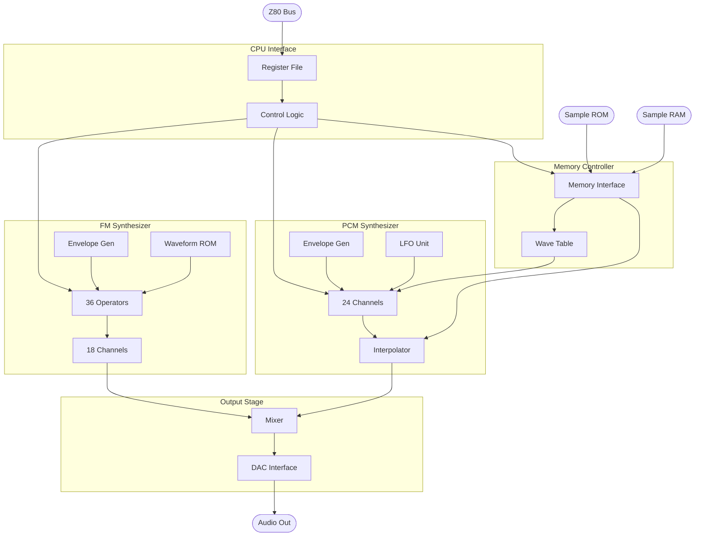
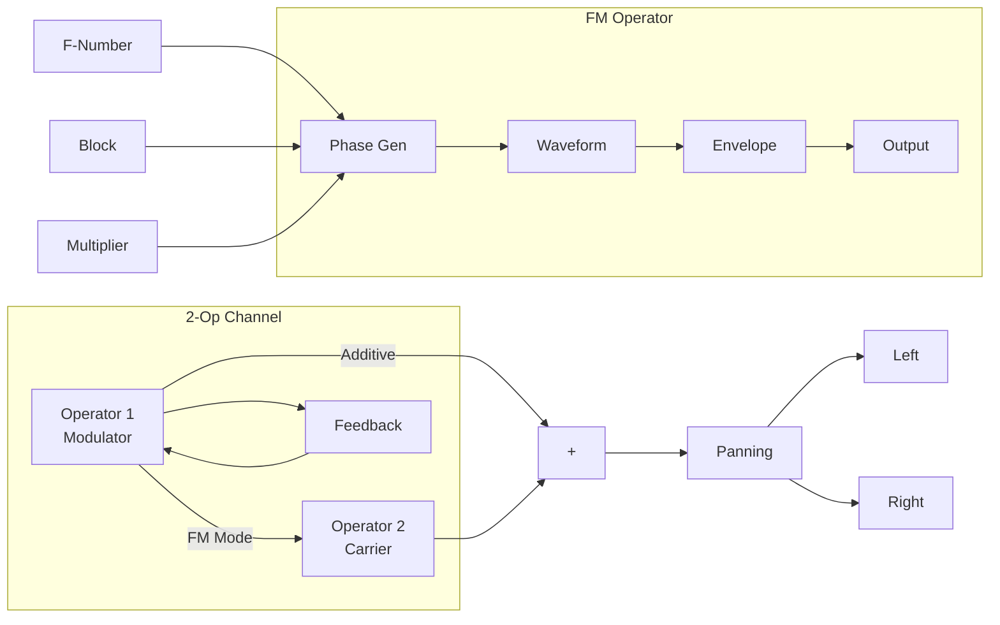
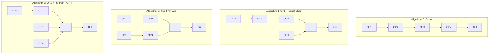
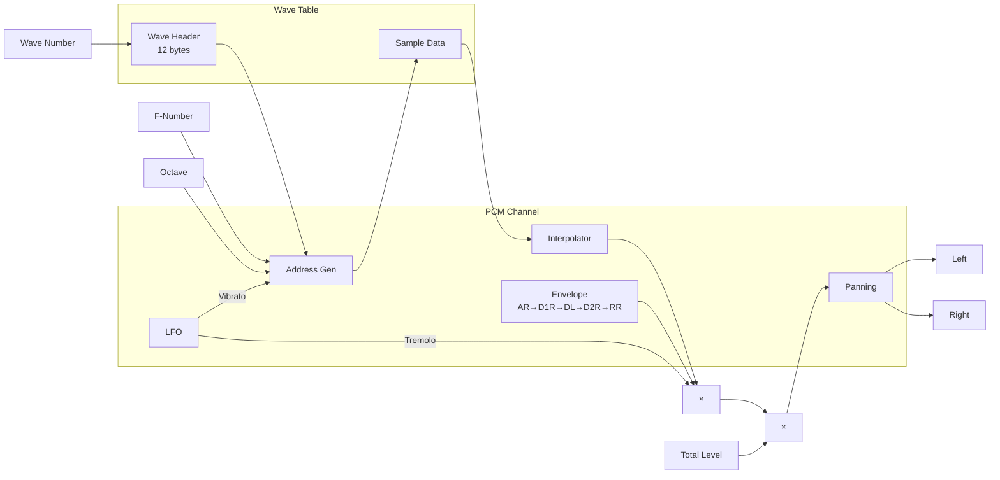
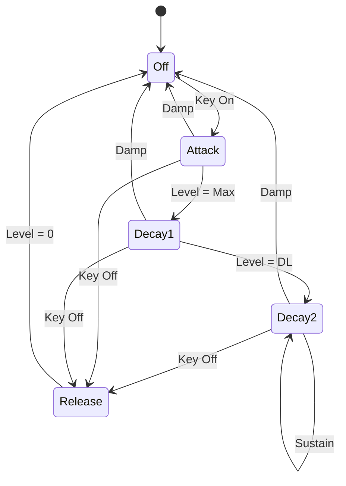
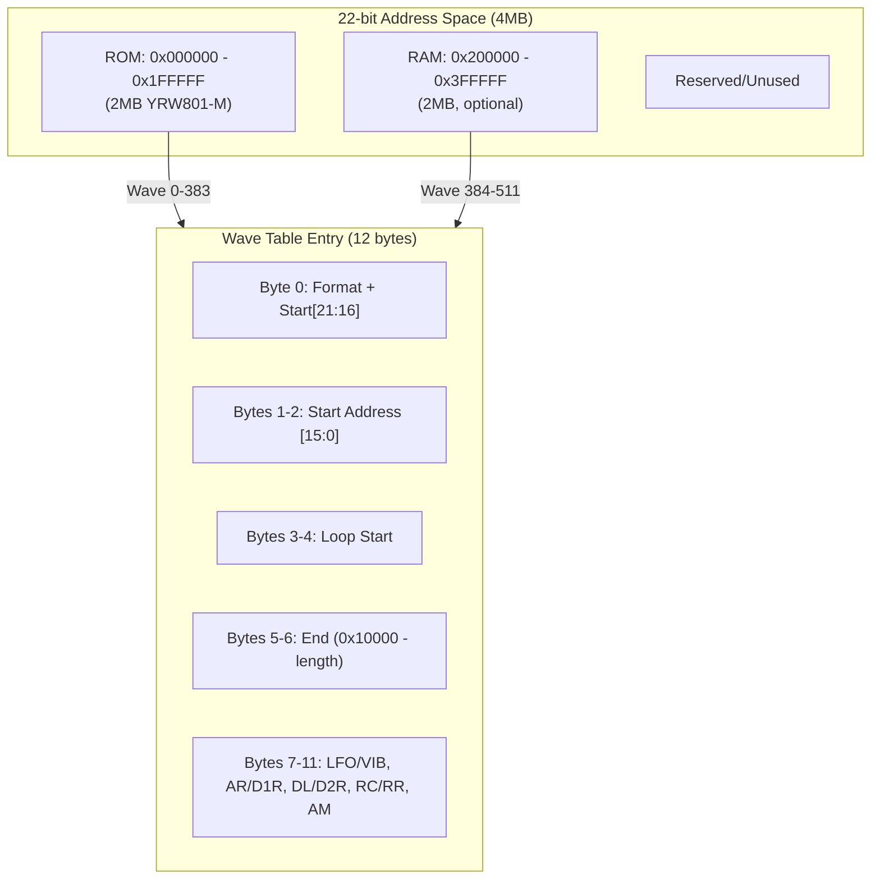
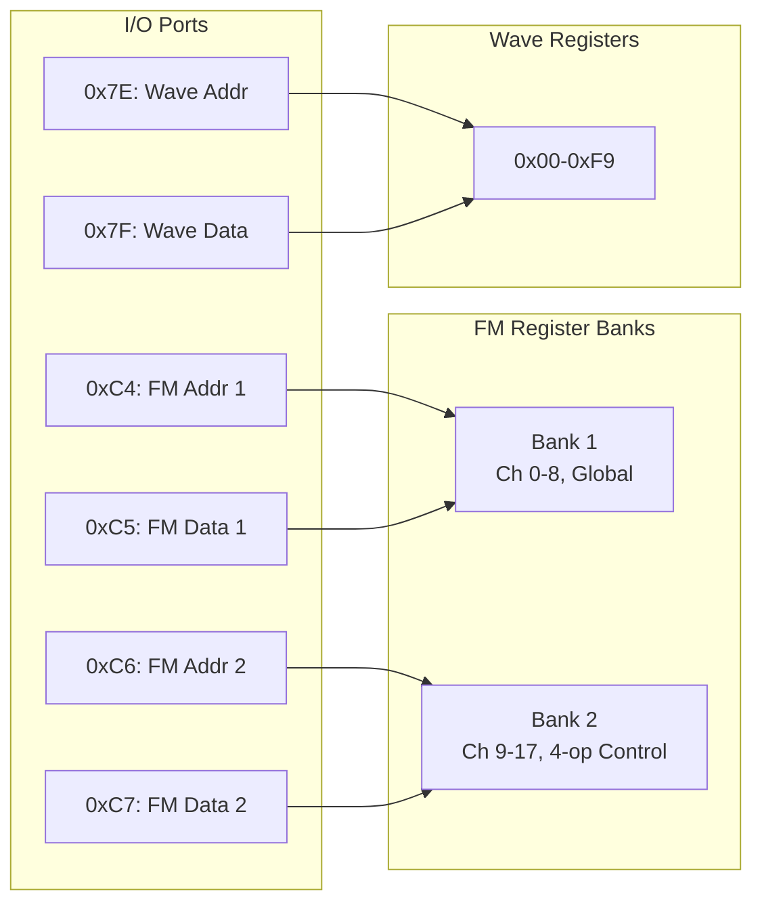
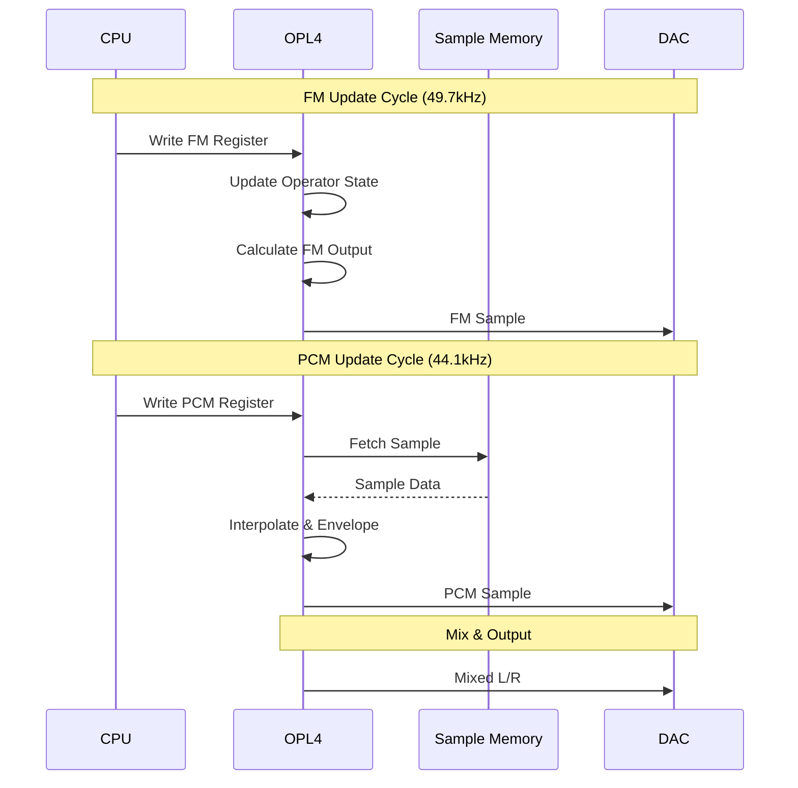

# OPL4 Block Diagram

This document provides a visual tour of the YMF278B's internal architecture. Each diagram focuses on a specific subsystem, and the accompanying text explains what happens at each stage — not just *what* the blocks are, but *why* they're connected the way they are.

## High-Level Architecture

The top-level view shows the OPL4's four major subsystems and how they interconnect. The CPU interface accepts register writes through six I/O ports and distributes them to three destinations: the FM synthesis engine, the PCM synthesis engine, and the memory controller. Both synthesis engines produce stereo audio that feeds into a shared mixer, which drives the external DAC.

Notice the critical asymmetry: the **FM engine is entirely self-contained** — it generates sound from its internal waveform ROM and operator pipeline without touching external memory. The **PCM engine depends on the memory controller** for every sample it plays, creating a constant stream of memory fetch traffic. This is why the memory controller must carefully arbitrate between PCM playback reads (which are time-critical and cannot stall) and CPU writes for sample uploads (which can tolerate brief delays).

## FM Synthesis Data Flow

Each FM operator is a complete sound-generation unit: a phase generator steps through a waveform at a rate determined by the frequency registers, the waveform lookup converts that phase angle into an amplitude, and the envelope generator shapes the amplitude over time. The operator's output is either used as audio or fed into another operator as a frequency modulator — this is the fundamental principle of FM synthesis.

The **F-Number** (10 bits), **Block** (3 bits, acting as octave), and **Multiplier** (4 bits per operator) together determine the operator's oscillation frequency. The F-Number provides fine pitch control within an octave, the Block shifts the frequency by powers of two (like selecting an octave on a keyboard), and the Multiplier scales the operator's frequency relative to the channel's base pitch — setting a modulator's Multiplier to 2× creates second-harmonic modulation, which produces a distinctly different timbre than 1× or 3×.

**Feedback** is the FM engine's secret weapon for complex timbres. Operator 1 can feed its own output back into its phase input, creating self-modulation. At low feedback levels (1–2), this adds subtle harmonic richness. At high levels (6–7), the operator becomes increasingly chaotic, producing noise-like textures useful for cymbals, wind, and distortion effects. The feedback value selects how many bits of the output are fed back, with 0 meaning no feedback and 7 providing the maximum π/1 modulation depth.

In **FM mode**, Operator 1's output modulates Operator 2's phase — only Operator 2 (the "carrier") produces audible output. In **Additive mode**, both operators produce independent audio that is summed together, doubling the channel's harmonic complexity at the cost of losing the FM interaction.

## 4-Operator FM Algorithms

When two 2-op channels are paired into a 4-op channel (via register 0x104), the four operators can be connected in one of four topologies. Each algorithm produces a fundamentally different character of sound:

- **Algorithm 0 (Serial)** chains all four operators end-to-end: OP1→OP2→OP3→OP4. Each stage modulates the next, creating extremely complex spectra. This produces the richest, most "metallic" FM timbres — think electric piano, complex bells, or heavily modulated brass. Only OP4 (the final carrier) produces audible output.

- **Algorithm 1 (OP1 + Serial Chain)** sums a lone carrier OP1 with a three-stage chain OP2→OP3→OP4. The chain supplies the complex FM timbre while OP1 adds a pure (or feedback-coloured) component on top.

- **Algorithm 2 (Two FM Pairs)** runs two independent 2-op FM chains (OP1→OP2 and OP3→OP4) and sums their outputs. This is like having two 2-op channels layered together — ideal for rich organ sounds, thick unison patches, or creating a lead voice with its own built-in accompaniment.

- **Algorithm 3 (OP1 + FM Pair + OP4)** sums three outputs: OP1 on its own, the 2-op FM pair OP2→OP3, and OP4 on its own. It is the most additive of the four algorithms, useful for organ-like tones with one modulated component.

## PCM Channel Data Flow

The PCM engine's signal path is quite different from FM. Instead of generating sound algorithmically, each PCM channel reads sample data from memory, interpolates between sample points for smooth pitch-shifting, and shapes the result with an envelope and LFO. The **Wave Number** is the starting point: it indexes into the wave table to find a 12-byte header that tells the channel where the sample lives in memory, how it loops, and its native format.

The **Address Generator** is the heart of PCM pitch control. It maintains a 32-bit accumulator that steps through the sample data at a rate determined by the F-Number and Octave registers. A higher F-Number means faster stepping through samples, producing a higher pitch. The Octave register provides coarse pitch control in octave (power-of-two) steps, while F-Number gives fine tuning within each octave. This is conceptually similar to FM's Block/F-Number system, but operates on memory addresses rather than phase angles.

The **Interpolator** smooths the output when the playback rate doesn't align with the sample's native rate. Without interpolation, pitch-shifting a sample produces audible stepping artifacts (aliasing noise). The OPL4 uses linear interpolation between adjacent sample points — a simple but effective technique that significantly improves audio quality at the cost of slightly rolling off high frequencies.

**LFO modulation** adds two kinds of periodic variation: **vibrato** modulates the address generator's step rate, creating pitch wobble; **tremolo** modulates the envelope's attenuation, creating volume pulsation. Both share the same LFO oscillator per channel, with independently selectable depths. The 8 available LFO speeds range from a gentle 0.168 Hz to a rapid 5.56 Hz.

**Total Level** (TL) is the master volume control for the channel, applied as attenuation *after* the envelope. It ranges from 0 (full volume) to 127 (silence), with each step representing approximately 0.375 dB. This is a separate control from the envelope — TL sets the channel's baseline level, while the envelope shapes how that level changes over time.

## PCM Envelope Stages

The PCM envelope is a 6-stage state machine that shapes every note's volume contour. Unlike the FM engine's simpler 4-stage ADSR, the PCM envelope splits the decay phase into two segments with a configurable breakpoint, enabling natural instrument emulation that would be impossible with a single decay rate.

The state transitions map directly to musical behavior:

- **Key On → Attack**: The note begins. The Attack Rate (AR) controls how quickly the volume rises from silence to maximum. A fast AR produces a percussive attack; a slow AR creates a fade-in.
- **Attack → Decay1**: Once the envelope reaches maximum level, it immediately begins decaying at the D1R rate. This is the "initial decay" — the rapid volume drop after a piano hammer strikes, or the quick fade of a plucked guitar's initial transient.
- **Decay1 → Decay2**: When the level drops to the Decay Level (DL), the decay rate switches to D2R. This second decay is typically much slower — it's the sustain phase where a piano note gently fades, or an organ holds steady. If D2R is 0, the note sustains indefinitely at DL.
- **Key Off → Release**: When the key is released, the envelope decays to silence at the Release Rate (RR), regardless of which stage it was in. This controls how quickly a note fades after the player lifts the key.
- **Damp → Off**: The Damp function is unique to the PCM engine. It provides an immediate, rapid mute — much faster than even the fastest Release Rate. This is used for note stealing (when a new note must replace a still-sounding one on the same channel) and ensures clean transitions without audible overlap.

## Memory Organization

The OPL4's 22-bit address space (4MB) is divided between ROM and RAM, with the wave table providing an indirection layer that maps wave numbers to physical sample addresses.

The wave table is the bridge between the programmer and the samples. When a PCM channel is assigned a **Wave Number**, the hardware reads the corresponding 12-byte header to determine everything it needs: where the sample data starts in memory, the sample format (8/12/16-bit), where the sample loops, and its default LFO and envelope settings. This indirection means the programmer never needs to manage raw memory addresses — selecting Wave Number 42 automatically fetches the right instrument, at the right memory location, in the right format.

The ROM's 384 wave table entries occupy wave numbers 0–383 and contain the YRW801-M General MIDI instrument set. Wave numbers 384 and above reference user samples in RAM. The wave table itself is stored in ROM (for built-in instruments) or written by the CPU at the start of sample RAM, 0x200000 (for user instruments, with register 0x02 = 0x10).

## Register Banks

The OPL4's registers are accessed through two separate I/O port systems, reflecting its dual-engine architecture. The FM registers use the traditional OPL3 dual-bank scheme (ports 0xC4/C5 for Bank 1, 0xC6/C7 for Bank 2), while the PCM registers use their own independent port pair (0x7E/0x7F).

A subtle but critical detail for emulator authors: the FM data ports (0xC5 and 0xC7) are **not rigidly bound to their respective banks**. The data write goes to whichever bank was selected by the most recent address write. The MoonBlaster player exploits this — traffic captures show occasional writes to port 0xC5 that target Bank 2 registers, because the preceding address write went to port 0xC6. An emulator that hard-associates data ports with banks will silently misroute these writes, producing incorrect sound. The correct implementation tracks a single "last address port used" state and directs data writes accordingly.

## Timing

The following sequence diagram shows the interplay between FM and PCM update cycles. These run at different rates (49.7 kHz and 44.1 kHz respectively) and are asynchronous — the mixer must combine outputs from two engines that update at different times.

The key timing constraint is the PCM engine's memory bandwidth. With 24 channels each fetching sample data at 44.1 kHz, the memory controller handles up to **1,058,400 sample fetches per second** — and each fetch requires addressing, waiting for the memory to respond, and latching the data. This is why the OPL4 uses dedicated memory buses rather than sharing the CPU's bus: the sample traffic would overwhelm any shared bus architecture.

CPU register writes are asynchronous to both engines. The CPU can write at any time, and the new values take effect at the next engine update cycle. This means there is inherent latency between a register write and its audible effect — typically one sample period (≈20 µs for FM, ≈23 µs for PCM). For the MoonBlaster player running at 50 Hz frame rate, this latency is negligible, but it matters for cycle-accurate emulation of rapid register updates.

## See Also

- [Overview](overview.md) — Chip specifications and capabilities
- [Memory Map](memory-map.md) — Detailed address space organization
- [FM Registers](../registers/fm-registers.md) — FM register reference
- [PCM Registers](../registers/pcm-registers.md) — PCM register reference
