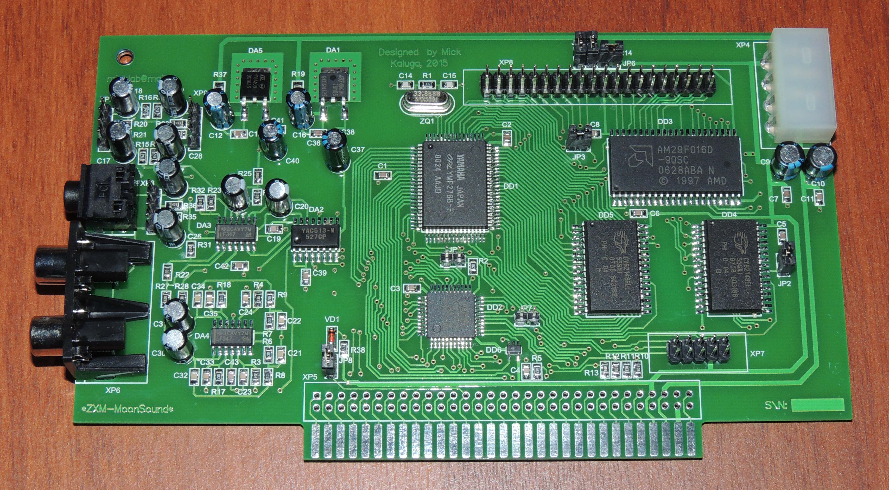
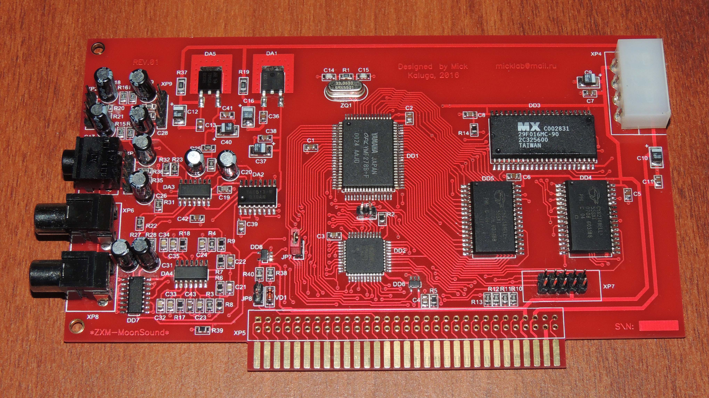

# ZXM-MoonSound Hardware

Complete hardware documentation for the ZXM-MoonSound sound card.

## Overview

The ZXM-MoonSound is a sound card for ZX Spectrum compatibles (Pentagon 512K) with ZX Bus/Nemo Bus slot. It is based on the Yamaha YMF278B (OPL4) chip, providing:

- **18 FM channels** (2-operator, OPL3-compatible)
- **24 PCM channels** (12/16-bit digital audio)
- **2MB ROM** for General MIDI samples
- **1MB SRAM** for user samples

## History

| Year | Event |
|------|-------|
| 1995 | Original **MoonSound** designed by Henrik Gilvad, presented at Tilburg computer fair |
| 2012 | **Wozblaster** for MSX by Gustavo Iriarte (Ciro, Argentina) |
| 2013 | Adapted to Konami cartridge form factor by Evgeny Brychkov |
| 2015 | **ZXM-MoonSound** adapted for ZX Spectrum by Mick (Максов И.Н.) |
| 2016 | **Revision 01** production run organized by Vitaliy Mikhalkov (MV1971) |

## Board Revisions

### Revision 00 (2015)

- Original design, 24 units produced
- Green solder mask
- Uses GAL16V8-equivalent logic via CPLD EPM7032STC44
- AM29F016D flash for sample ROM (programmable via external cable)
- External audio mixer input

**Files:**
- `schematics/zxm_moonsound_sch00.rar` - Schematic (P-CAD 2002)
- `pcb/zxm_moonsound_pcb00.rar` - PCB layout (P-CAD 2002)
- `schematics/zxm_moonsound_00.pdf` - Schematic, assembly, BOM (PDF)
- `schematics/zxm_moonsound_annex.pdf` - DD3 (AM29F016D) programming guide

### Revision 01 (2016)

- Red solder mask
- Changed RCA connectors
- Added mounting holes for bracket
- SMD capacitors replacing some through-hole electrolytics
- Removed external flash programming connector (now via YMF278)
- **Note:** DD7, DD8, R39 were experimental pop-reduction circuit - failed, do not install

**Files:**
- `schematics/zxm_moonsound_sch01.rar` - Schematic (P-CAD 2002)
- `pcb/zxm_moonsound_pcb01.rar` - PCB layout (P-CAD 2002)
- `pcb/zxm_moonsound_gerber01.rar` - Gerber files for manufacturing
- `schematics/zxm_moonsound_01.pdf` - Schematic, assembly, BOM (PDF)
- `schematics/zxm_moonsound_annex_rev01.pdf` - Rev 01 modifications

## Specifications

| Parameter | Value |
|-----------|-------|
| Sound chip | Yamaha YMF278B (OPL4) |
| FM synthesis | 18 channels, 2-op |
| PCM synthesis | 24 channels, 12/16-bit |
| Sample ROM | 2048 KB (General MIDI) |
| Sample RAM | 1024 KB (SRAM) |
| CPLD | Altera EPM7032STC44 |
| Flash ROM | AM29F016D (2MB) |
| Audio output | 3.5mm jack, 2x RCA, 4-pin header |
| Bus interface | ZX Bus / Nemo Bus (62-pin) |

## I/O Ports

| Port | Function |
|------|----------|
| 0xC4 | FM Register 1 (address) |
| 0xC5 | FM Data 1 |
| 0xC6 | FM Register 2 (address) |
| 0xC7 | FM Data 2 |
| 0x7E | Wave Register (address) |
| 0x7F | Wave Data |

## Firmware

### Sample ROM

- `firmware/yrw801m_1993.rar` - YRW801-M wavetable ROM image
  - Contains General MIDI instrument samples
  - Required for PCM/wavetable playback
  - Flash to AM29F016D (DD3)

### CPLD Firmware

**Revision 00:**
- `firmware/zxm_moonsound_frm0100.rar` - CPLD firmware v01.00 (POF/JED)
- `firmware/zxm_moonsound_src0100.rar` - CPLD source (VHDL/Verilog)

**Revision 01:**
- `firmware/zxm_moonsound01_frm0100.rar` - CPLD firmware v01.00 for rev 01
- `firmware/zxm_moonsound01_src0100.rar` - CPLD source for rev 01

## Tools

### MoonService

Service utility for ZXM-MoonSound diagnostics and programming.

| Version | Date | Description |
|---------|------|-------------|
| v01 | 2015-08 | Initial release |
| v02 | 2016-04 | Improvements |
| v03 | 2016-06 | ROM programming via YMF278 |
| v03a | 2016-08 | Bug fixes |

**Files in `tools/moonservice/`:**
- `moonservice_vXX.rar` - TR-DOS disk image
- `moonservice_vXXsrc.rar` - Assembly source code

## PCB Libraries

- `pcb/zxm_moonsound_lib.rar` - P-CAD 2002 component libraries

## Building

### Requirements

- P-CAD 2002 (or compatible) for schematic/PCB editing
- Altera Quartus II (or compatible) for CPLD compilation
- Flash programmer supporting AM29F016D

### CPLD Programming

See [cpld-sources/README.md](cpld-sources/README.md) for detailed instructions.

**Quick steps:**
1. Open project in Quartus II
2. Compile to generate POF/JED
3. Program EPM7032STC44 via JTAG (ByteBlaster or compatible)

**CPLD Sources:** Extracted in `cpld-sources/`:
- `v0100-original/` - Original board (2015)
- `v0100-rev01/` - Revised board (2016)

### Flash ROM Programming

**Revision 00:** External programmer via dedicated header

**Revision 01:** Via YMF278 using MoonService v03+:
1. Boot MoonService from TR-DOS
2. Select "Program ROM" option
3. Load ROM image from disk

## Attribution

- **Original MoonSound** - Henrik Gilvad (1995)
- **Wozblaster** - Gustavo Iriarte / Ciro (2012)
- **ZXM-MoonSound adaptation** - Evgeny Brychkov (2013), Mick / Максов И.Н. (2015)
- **Revision 01 production** - Vitaliy Mikhalkov / MV1971 (2016)

Source: [micklab.ru](http://micklab.ru/My%20Soundcard/ZXMMoonSound.htm)
